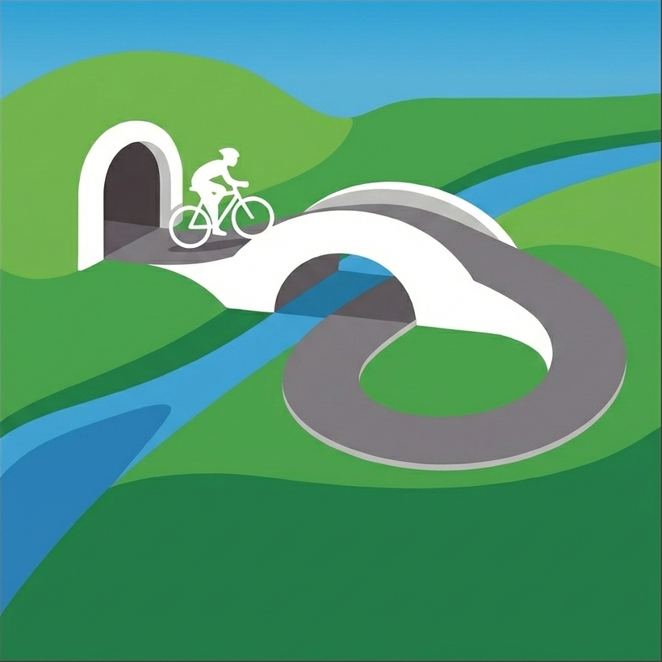

# Biketerra Brunnels

A Chrome extension that automatically detects bridges and tunnels ("brunnels") from OpenStreetMap and applies them to routes in the [Biketerra](https://biketerra.com) editor.

## Features

- Detects bridges and tunnels along your route using OpenStreetMap data
- Filters brunnels by containment, bearing alignment, and overlap resolution
- One-click application of all detected brunnels to your route

## Installation

Since this extension isn't published to the Chrome Web Store, you'll need to install it manually:

1. **Download the extension**:
   - Clone this repository or download and extract the ZIP file

2. **Load the extension in Chrome**:
   - Open Chrome and go to `chrome://extensions/`
   - Enable **Developer mode** (toggle in top right)
   - Click **Load unpacked**
   - Select the folder containing this extension

3. **Pin the extension** (recommended): Click the puzzle piece icon in Chrome's toolbar and pin "Biketerra Brunnels" for easy access.

## Usage

1. Open a **previously saved** route in the Biketerra editor (`https://biketerra.com/routes/new?id=...`)
   - Note: The route must be saved first. Brand-new unsaved routes don't have a route ID and won't work.
2. Click the extension icon in Chrome's toolbar
3. Adjust options if needed:
   - **Query buffer**: Search radius around route for Overpass API (default: 10m)
   - **Route buffer**: Containment tolerance for filtering (default: 3m)
   - **Bearing tolerance**: Alignment tolerance in degrees (default: 20°)
4. Click **"Locate Brunnels"**
5. Review the detected bridges and tunnels in the list
6. Click **"Apply All to Route"** to add them to Biketerra

## How It Works

### Brunnel Detection

The extension queries OpenStreetMap via the Overpass API for bridges and tunnels within a bounding box around your route. It excludes:
- Waterways
- Ways marked `bicycle=no`
- Active railway infrastructure (rail, light_rail, subway, tram, etc.)

Cycleways (`highway=cycleway`) are always included.

### Filtering Pipeline

1. **Containment**: Only brunnels fully within the buffered route geometry
2. **Route span calculation**: Projects brunnel endpoints onto the route
3. **Alignment**: Filters by bearing alignment between brunnel and route segment
4. **Overlap resolution**: When multiple brunnels cover the same route segment, keeps the one closest to the route

### UI Automation

The extension simulates the native Biketerra workflow by:
1. Converting brunnel distances to x-coordinates on the elevation chart
2. Dispatching shift+drag events to select the region
3. Clicking the bridge or tunnel toolbar button

## Troubleshooting

### "Could not extract route data"
- Make sure a route is fully loaded in the editor
- Try refreshing the page and waiting for it to fully load

### Brunnels not being applied
- The extension relies on Biketerra's UI elements. If the UI has changed, the selectors may need updating.
- Check the browser console (F12) for error messages.

### Rate limiting from Overpass API
- The extension queries the public Overpass API which has rate limits
- Wait a few minutes between queries for long routes

## Feedback

This extension is in beta. Please report issues or suggestions at:
https://github.com/jsmattsonjr/bt-brunnels/issues

## Acknowledgements

This extension uses the following third-party services and libraries:

### Turf.js

Geospatial analysis functions are provided by [Turf.js](https://turfjs.org/).

MIT License - Copyright (c) 2019 Morgan Herlocker

### OpenStreetMap / Overpass API

Bridge and tunnel data is sourced from [OpenStreetMap](https://www.openstreetmap.org/) via the [Overpass API](https://overpass-api.de/).

OpenStreetMap data is available under the [Open Database License (ODbL)](https://opendatacommons.org/licenses/odbl/). © OpenStreetMap contributors.

## License

MIT License
